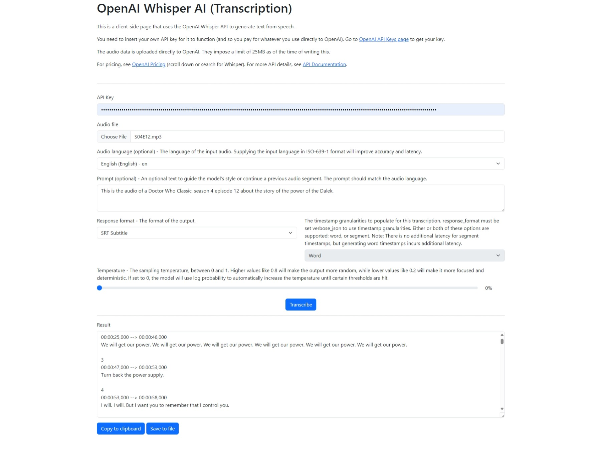

To use this page, simply click the link on the right or https://datvm.github.io/OpenAiWhisperClient/.

This is a _client-side_ page that uses the OpenAI Whisper API to generate text from speech. Everything runs in the browser, so no data is sent to any server except to OpenAI's API. The page is hosted on GitHub Pages, so you can use it without any setup.

This page simply use [OpenAI Create transcription](https://platform.openai.com/docs/api-reference/audio/createTranscription) to transcribe audio into the input language. It can output to text, subtitle (SRT or VTT) or timestamped plain text or JSON.

You have to provide your own OpenAI API key to use this page. You can get one at [OpenAI API keys page](https://platform.openai.com/api-keys). The key is not stored anywhere and is only sent to OpenAI's API.

For the Pricing, see [OpenAI Pricing](https://platform.openai.com/pricing). For example, the transcription of the above movie file of 25 minutes was about 4 US cents ($0.04).